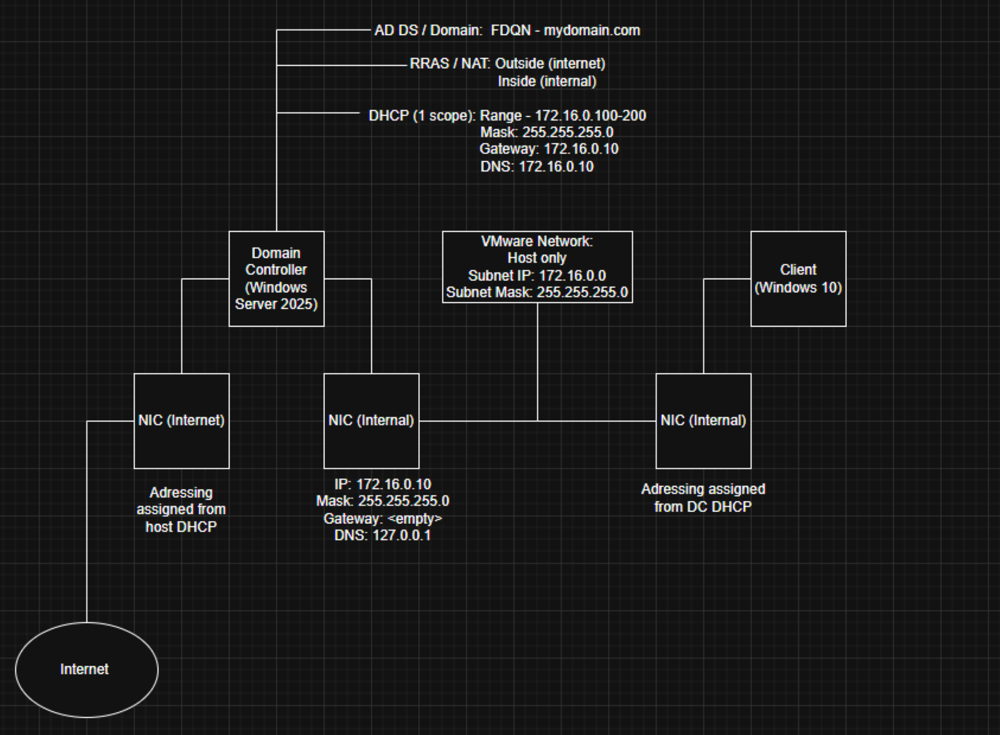
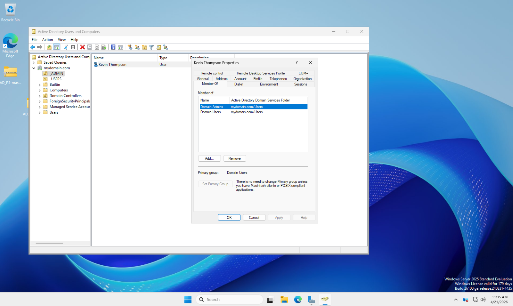
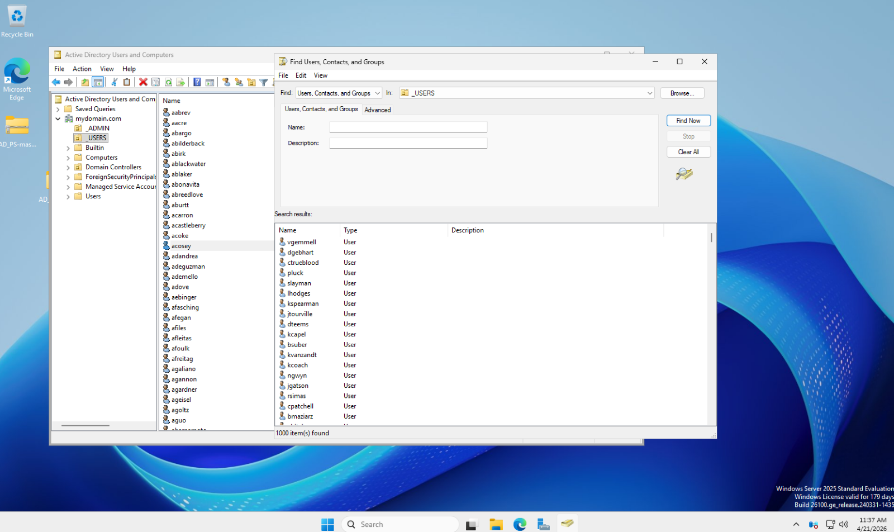
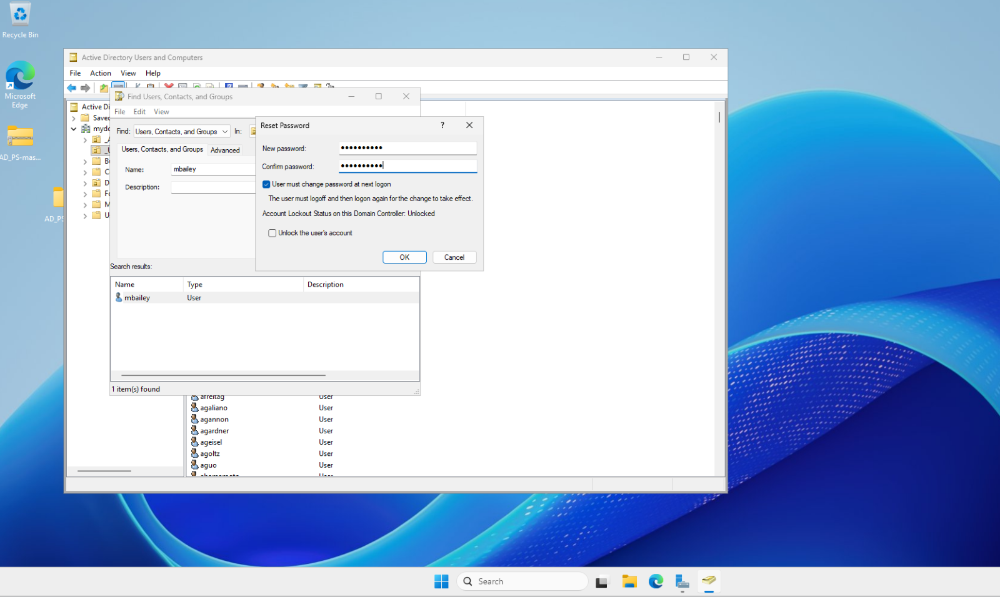
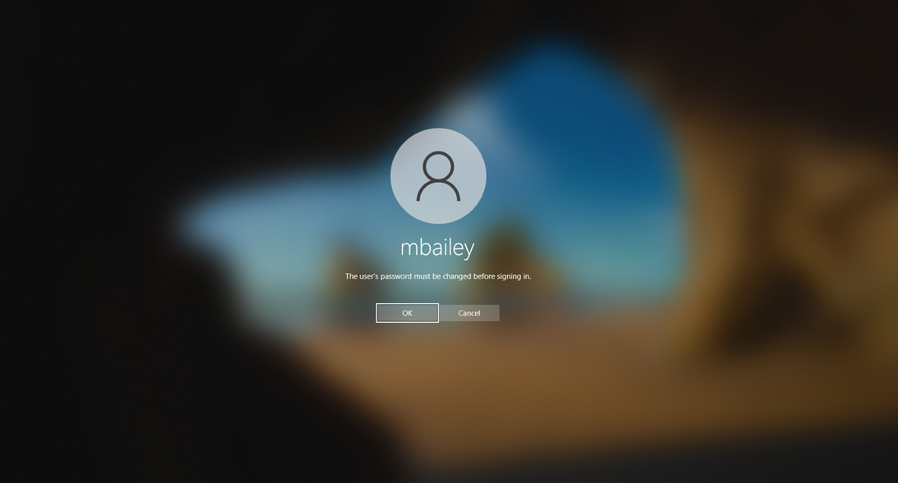

# Introduction/Objectives:
The goal of this lab is to gain hands-on experience implementing security architecture and controls within an active directory environment.

Active Directory (AD): When a Windows Server is promoted to a domain controller, it acts as a centralized database

Domain Controller (DC): Manages the AD database. Handles account management for all users, computers, and groups in the domain

# Environment:
-VMware Workstation

-Windows Server 2025 ISO

-Windows 10 Education ISO

# Network Diagram:
In VMware, I installed Windows server 2025 for my DC, with two network interface cards (NICs) – one card using NAT from the host to access the internet and one internal card using host-only to act as a gateway. Client machines within the domain will route their internet traffic through the internal NIC to the internet NIC. 
For the client machine, I installed Windows 10 Educational Edition. I have a Windows 11 iso, however it is the home edition, and the home edition cannot join a domain. The NIC on this machine used the same host-only adapter that the DC’s internal NIC used (VMnet3, in this case)

# Project 1: Adding Users and Resetting Passwords
For now, I have created two organizational units - _ADMINS and _USERS

Organizational Unit (OU): A structural subset within a larger organization such as a department, team, or branch. Specific permissions or policies can be assigned to resources and employees within each unit. 

In the _ADMINS, I have created my own admin account instead of using the default administrator account. I used the naming convention “a-name” to signify the account is an admin and added it to the domain admins group. 

To add a large number of users to the Domain, I used this PowerShell script (https://github.com/joshmadakor1/AD_PS/blob/master/Generate-Names-Create-Users.ps1) with a text file containing 1000 randomly generated names (including my name, for a regular non-admin account used for ‘daily’ work). For ease, all the accounts were created with the same password of “Password1”. 

## Resetting a Password:

In this fictional scenario, one of our users Michell Bailey comes back to work after taking two weeks off for a vacation and can’t remember what his password is. After multiple failed logins, he contacts the IT team (myself) and asks for a password reset. 
In Active Directory Users and Computers, under the _USERS OU, I find Michell Bailey’s account, right click, and select reset password. I use the temporary new password of “Summer2026” and make sure “User must change password at next logon” is checked. 

Mitchell was able to access his account again and update his password.

# Future Projects:

-Changing/assigning users permissions

-Experimenting with Group Policy Objects

-Implementing a SIEM and simulating an attack from an adversary

-Performing a vulnerability scan on the environment

